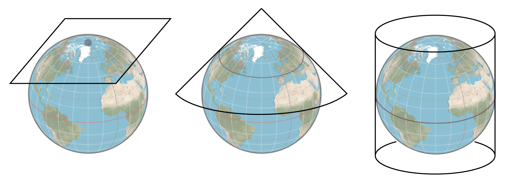
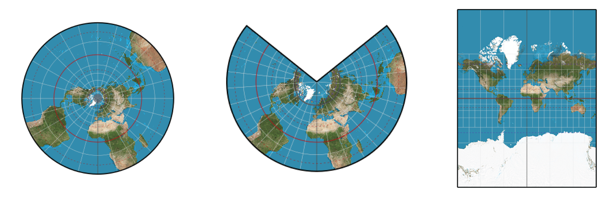

## Objectifs de la formation

À la fin de cette formation, vous serez en mesure de :

- Créer, importer et exporter des géométries vectorielles avec `sf`
- Réaliser des opérations spatiales courantes (filtrage, reprojection, tampon, découpage)
- Importer et manipuler des données raster avec `raster`
- Extraire, découper, reprojeter et empiler des couches matricielles

## Installation des packages

```r
install.packages(c("sf", "raster", "mapview"))
```

## Au programme

1. Vue d'ensemble des objets spatiaux
2. Manipulation des vecteurs spatiaux (POINT, LIGNE, POLYGONE)
3. Opérations spatiales sur les vecteurs
4. Manipulation des rasters
5. Opérations spatiales sur les rasters

---

# Vue d'ensemble des objets spatiaux {background-color="#3687f9"}

## Vecteurs spatiaux

{fig-align="center" width="100%"}

## Rasters

{fig-align="center" width="100%"}

---

# Système de référence de coordonnées (CRS) {background-color="#3687f9"}

## CRS — Définition

Les projections sont définies comme des systèmes de référence de coordonnées (CRS)

### CRS géographique (non projeté)

{fig-align="center" width="60%"}

### CRS projeté

{fig-align="center" width="60%"}

## CRS — Propriétés

### CRS géographique (non projeté)

- Latitude et longitude : angles mesurés depuis le centre de la Terre
- Représentation 3D de la Terre (sphère ou ellipsoïde)
- Distances mesurées en degrés, **pas en mètres**
- Lon/Lat localisent tout point sur la surface, mais ne sont pas uniformes

### CRS projeté

- Utilise des coordonnées cartésiennes, Est et Nord (x et y) **typiquement en mètres**
- Représentation 2D de la Terre
- Tous les CRS projetés sont basés sur un CRS géographique
- Différentes formules mathématiques (projections) transforment le globe 3D en carte 2D

## Géographique vs projeté

{fig-align="center" width="80%"}

La représentation peut être similaire à fine échelle, **mais très différente à grande échelle.**

## CRS — EPSG / SRID

- Chaque CRS possède un identifiant spatial appelé SRID ou EPSG
- En R, la notation utilisée est le **proj4string** de la librairie PROJ.4 :

`+init=epsg:4326 +proj=longlat +ellps=WGS84 +datum=WGS84 +no_defs`

Pour rechercher un CRS spécifique : [spatialreference.org](https://spatialreference.org/)

Exemple : <https://spatialreference.org/ref/epsg/4326/>

[Overview of Coordinate Reference Systems (CRS)](https://www.nceas.ucsb.edu/~frazier/RSpatialGuides/OverviewCoordinateReferenceSystems.pdf)

## CRS — Fonctions R

Des fonctions R permettent de manipuler les CRS :

- `sf::st_crs(4326)`
- `sf::st_transform(objet, 3347)`

---

# Manipulation des vecteurs spatiaux {background-color="#3687f9"}

Points, Lignes & Polygones

## Packages R pour les vecteurs spatiaux

- `sp` : classes et méthodes pour les données spatiales (ancien)
- `maptools` & `rgeos` : fonctions de manipulation (ancien)
- `sf` : Simple Features pour R, conforme au standard [OGC](https://www.opengeospatial.org/)

. . .

Dans ce cours, nous utilisons principalement `sf`.

## Pourquoi `sf` ?

Pourquoi utiliser `sf` plutôt que `sp` ?

1. Standard formel ISO 19125-1:2004 décrivant les objets géographiques
2. Successeur de `sp`
3. `sf` intègre les fonctionnalités de 3 packages en un seul :
   - `sp` pour le système de classes
   - `rgdal` pour la lecture/écriture des données
   - `rgeos` pour les opérations spatiales (GEOS)

## Pourquoi `sf` ?

Les objets `sf` sont faciles à manipuler : stockés comme des `data.frame`, avec les géométries dans une colonne liste

{fig-align="center" width="70%"}

::: {style="font-size: 0.7em"}
Illustration de [Allison Horst](https://twitter.com/allison_horst/status/1071456081308614656)
:::

## Structure d'un objet `sf`

{fig-align="center" width="100%"}

## `sfg` — Géométrie simple (1)

{fig-align="center" width="70%"}

## `sfg` — Géométrie simple (2)

{fig-align="center" width="70%"}

---

# Créer des objets spatiaux {background-color="#3687f9"}

## Points

Déclarer des sommets / points spatiaux (équivalent à un fichier .shp)

```{r}
library(sf)

ottawa    <- st_point(c(-75.69812, 45.41117))
sherbrooke <- st_point(c(-71.89908, 45.40008))
winnipeg  <- st_point(c(-97.14704, 49.8844))
calgary   <- st_point(c(-114.08529, 51.05011))
vancouver <- st_point(c(-123.11934, 49.24966))
```

Regrouper tous les points dans une colonne spatiale avec le CRS 4326 (WGS84)

```{r}
cities <- st_sfc(
  list(ottawa, sherbrooke, winnipeg, calgary, vancouver),
  crs = 4326
)
class(cities)
```

## Déclarer les attributs

```{r}
attr_table <- data.frame(
  N    = c(1236324, 212105, 804200, 1406700, 2463431),
  name = c("Ottawa", "Sherbrooke", "Winnipeg", "Calgary", "Vancouver")
)
attr_table
```

## Déclarer le CRS

```{r}
proj <- st_crs(4326)
proj
```

## Attacher la table d'attributs et le CRS

```{r}
great_cities <- st_sf(attr_table, geom = cities, crs = proj)
great_cities
```

## Vérification visuelle

```{r}
#| fig-height: 4
#| fig-width: 6
#| fig-align: center
plot(great_cities[, "N"])
```

## Vérification visuelle (interactive)

```{r}
#| out-height: "65%"
#| out-width: "100%"
library(mapview)
mapview(great_cities, zoom = 1)
```

## Lignes

```{r}
#| fig-height: 4
#| fig-width: 4
#| fig-align: center
line <- st_linestring(rbind(c(0, 0), c(1, 1), c(2, 1)))
class(line)

plot(line, col = "red", lwd = 2)
plot(st_cast(line, "MULTIPOINT"), pch = 19, add = TRUE)
```

## Polygones

```{r}
#| fig-height: 3
#| fig-width: 3
#| fig-align: center
outer <- matrix(c(0,0,10,0,10,10,0,10,0,0), ncol = 2, byrow = TRUE)
hole1 <- matrix(c(1,1,1,2,2,2,2,1,1,1),    ncol = 2, byrow = TRUE)
hole2 <- matrix(c(5,5,5,6,6,6,6,5,5,5),    ncol = 2, byrow = TRUE)
poly  <- st_polygon(list(outer, hole1, hole2))
plot(poly, col = "red")
```

C'est pourquoi on importe généralement les lignes et polygones depuis des shapefiles, et les points depuis des CSV.

---

# Importer et exporter des objets spatiaux {background-color="#3687f9"}

## Importer des points depuis un CSV

```{r}
ca_cities <- read.csv("data/ca_cities.csv")
head(ca_cities, 4)
```

. . .

Pour rendre ces données spatiales, il faut connaître :

- La latitude (`lat`)
- La longitude (`lng`)
- La projection (le CRS)

## Importer des points depuis un CSV

```{r}
#| out-height: "65%"
#| out-width: "100%"
sf_ca_cities_wgs84 <- st_as_sf(ca_cities, coords = c("lng", "lat"), crs = 4326)
sf_ca_cities_wgs84$admin <- ca_cities$admin
sf_ca_cities_wgs84
```

## Formats supportés par `sf`

`sf` peut lire un grand nombre de formats vectoriels grâce à la librairie GDAL/OGC.

```{r}
st_drivers(what = "vector")[1:50, 1]
```

## Importer un shapefile ESRI

Côtes mondiales Natural Earth — [télécharger ici](https://naciscdn.org/naturalearth/10m/physical/ne_10m_coastline.zip) (déjà dans `data/ne-coastlines-10m/`)

## Fichiers d'un shapefile valide

- `.shp` : géométries (requis)
- `.shx` : index des géométries (requis)
- `.dbf` : table d'attributs (requis)
- `.prj` : système de coordonnées (utilisé par ArcGIS)

```{r}
coast <- st_read("data/ne-coastlines-10m")
```

```{r}
#| fig-align: center
#| fig-height: 4
#| fig-width: 6
par(mar = rep(0, 4))
plot(st_geometry(coast))
```

## Importer depuis une GeoDatabase

Exemple : Programme de surveillance aquatique communautaire (CAMP)
([open.canada.ca](https://open.canada.ca/data/en/dataset/c4474517-3d9b-e581-a6e2-e95273f2058e))

```{r}
st_layers("data/camp_station_summary_eng.gdb")
stations <- st_read("data/camp_station_summary_eng.gdb",
                    layer = "camp_station_summary_eng")
```

```{r}
#| echo: false
#| out-height: "50%"
#| out-width: "100%"
mapview(stations)
```

## Exporter des vecteurs spatiaux

Extraire le golfe du Saint-Laurent depuis les côtes mondiales :

```{r}
#| warnings: false
area <- st_as_sfc("POLYGON((-71.19219092922373 51.818174659518405,-55.06426124172373 51.818174659518405,-55.06426124172373 45.47097576656452,-71.19219092922373 45.47097576656452,-71.19219092922373 51.818174659518405))")
area <- st_set_crs(area, 4326)
cropped_coast <- st_crop(coast, area)
```

```{r}
#| fig-align: center
par(mar = rep(0, 4))
plot(st_geometry(cropped_coast))
```

## Exporter des vecteurs spatiaux

Sauvegarder en shapefile ESRI :

```{r}
#| eval: false
st_write(cropped_coast, dsn = "data/cropped_coast", driver = "ESRI Shapefile")
```

## Exercice pratique {.practice}

1. Télécharger le [shapefile des côtes](https://naciscdn.org/naturalearth/10m/physical/ne_10m_coastline.zip) sur votre ordinateur
2. Le lire avec `st_read()`

Si vous le souhaitez, essayez avec vos propres données ou d'autres shapefiles de <https://www.naturalearthdata.com/>

---

# Manipuler des objets spatiaux avec `sf` {background-color="#3687f9"}

## Filtrer par attributs

Sélectionner les villes du Manitoba :

```{r}
#| out-height: "75%"
#| out-width: "100%"
mb_cities <- subset(sf_ca_cities_wgs84, admin == "Manitoba")
mapview(mb_cities)
```

## Sélectionner / supprimer des entités

```{r}
mb_cities[1, ]
```

```{r}
mb_cities[-c(1:5), ]
```

## Reprojeter

Passer de WGS84 (SRID 4326) à NAD83 / Lambert Canada (SRID 3347) :

```{r}
sf_ca_cities_nad83 <- st_transform(sf_ca_cities_wgs84, 3347)
sf_ca_cities_nad83
```

## Créer des zones tampons

Zone tampon de 10 km autour des villes (POINT → POLYGONE) :

```{r}
#| out-width: "100%"
#| out-height: "55%"
buf_10K_cities <- st_buffer(sf_ca_cities_nad83, 10000)
mapview(buf_10K_cities)
```

## Opérations spatiales avec `sf`

{fig-align="center" width="85%"}

[Télécharger le cheat sheet `sf`](https://github.com/rstudio/cheatsheets/blob/master/sf.pdf)

## Exercice pratique {.practice}

1. Télécharger et lire avec `sf` le [CSV des villes canadiennes](data/ca_cities.csv)
2. Sélectionner toutes les villes de votre province
3. Sélectionner les 10 villes les plus peuplées de votre province

---

# Manipulation des rasters {background-color="#3687f9"}

## Données spatiales matricielles

Les données matricielles sont gérées avec le package `raster`.

{fig-align="center" width="90%"}

136 formats raster supportés par la librairie GDAL.

## Diversité des formats

:::: {.columns}
::: {.column width="50%"}
**Exemples**

*Format grillé classique*
```
GTiff: GeoTIFF
XYZ: ASCII Gridded XYZ
```

*Images*
```
PNG: Portable Network Graphics
JPEG: JPEG JFIF
```

*Multibandes (satellite)*
```
netCDF: Network Common Data Format
HDF4: Hierarchical Data Format 4
```
:::
::: {.column width="50%"}
{width="100%"}
:::
::::

## Charger un raster depuis un fichier

```{r}
library(raster)
ocean_bottom <- raster("data/OB_LR/OB_50M/OB_50M.tif")
ocean_bottom
```

```{r}
#| fig-height: 8
#| fig-width: 12
#| fig-align: center
image(ocean_bottom)
```

## Récupérer des données libres avec `geodata`

Le package `geodata` remplace `raster::getData()` :

- **`gadm()`** — limites administratives mondiales
- **`worldclim_country()`** — données climatiques interpolées
- **`elevation_30s()`** — données d'élévation (~1 km)

```{r}
library(geodata)
altCAN <- elevation_30s(country = "CAN", path = "data")
altCAN <- raster(altCAN)  # convertir en RasterLayer pour raster::extract()
altCAN
```

## Visualiser le raster

```{r}
#| fig-width: 12
#| fig-height: 7
#| fig-align: center
plot(altCAN)
```

## Extraire des valeurs à des emplacements précis

```{r}
sf_ca_cities_wgs84$elev <- extract(altCAN, sf_ca_cities_wgs84)
sf_ca_cities_wgs84$elev
```

## Découper et masquer un raster

`crop()` réduit l'étendue ; `mask()` met à NA les valeurs hors d'un polygone.

```{r}
#| eval: false
can    <- st_as_sf(geodata::gadm(country = "CAN", level = 1, path = "data"))
qc     <- subset(can, NAME_1 == "Québec")
alt_qc <- crop(altCAN, qc)
alt_mask <- mask(altCAN, qc)
```

```{r}
#| echo: false
can    <- st_as_sf(geodata::gadm(country = "CAN", level = 1, path = "data"))
qc     <- subset(can, NAME_1 == "Québec")
alt_qc <- crop(altCAN, qc)
```

```{r}
#| fig-align: center
#| fig-width: 6
#| fig-height: 6
plot(alt_qc)
```

## Reprojeter un raster

`projectRaster()` transforme le CRS d'un raster :

```{r}
alt_qc_nad83 <- projectRaster(alt_qc, crs = "+proj=lcc +lat_1=49 +lat_2=77
+lat_0=63.390675 +lon_0=-91.86666666666666 +x_0=6200000 +y_0=3000000 +ellps=GRS80
+towgs84=0,0,0,0,0,0,0 +units=m +no_defs")
```

```{r}
#| fig-width: 7
#| fig-height: 7
#| fig-align: center
plot(alt_qc_nad83)
```

## Exercice pratique {.practice}

1. Lire avec `sf` le [CSV des villes canadiennes](data/ca_cities.csv)
2. Importer avec `geodata::elevation_30s()` le MNT canadien
3. Reprojeter le raster et les villes en NAD83
4. Créer une zone tampon de 10 km autour de chaque ville
5. Découper le raster avec ces tampons et calculer la moyenne par tampon

---

# Empiler des rasters {background-color="#3687f9"}

## Stacking

Deux possibilités : par variable ou par période temporelle.

{fig-align="center" width="90%"}

## Exemple d'empilement

```{r}
rs_var1 <- raster(ncol = 10, nrow = 10)
rs_var2 <- raster(ncol = 10, nrow = 10)
rs_var1[] <- runif(100)
rs_var2[] <- runif(100)

st_vars <- stack(rs_var1, rs_var2)
st_vars
```

## Convertir en data.frame

```{r}
as.data.frame(st_vars, xy = TRUE)
```

```{r}
#| eval: false
as.data.frame(rs_var1, xy = TRUE)
```

## Opérations arithmétiques

- Opérateurs classiques : `+`, `*`, `-`, etc.
  - `rs_var1 + rs_var2`
- Somme : `sum(st_vars)`
- Moyenne : `mean(st_vars)`
- Variance : `var(rs_var1)`
- Covariance : `cov(rs_var1, rs_var2)`
- Histogramme : `hist(rs_var1)`

---

# Ressources en ligne {background-color="#3687f9"}

## Tutoriels (1/3)

### Tutoriels sur les données spatiales en R

- [Raster analysis in R](https://mgimond.github.io/megug2017/)
- [Geocomputation with R](https://geocompr.robinlovelace.net/intro.html)
- [Spatial data in R](https://github.com/Pakillo/R-GIS-tutorial/blob/master/R-GIS_tutorial.md)
- [Document par Nicolas Casajus (fr)](https://qcbs.ca/wiki/_media/gisonr.pdf)
- <http://r-spatial.org/>
- [R in space — Insileco](https://insileco.github.io/2018/04/14/r-in-space---a-series/)

### Manipulation avec `sf`

- [sf vignette #4](https://cran.r-project.org/web/packages/sf/vignettes/sf4.html)
- [Geocomputation with R](https://geocompr.robinlovelace.net/attr.html)
- [Tidy spatial data in R](http://strimas.com/r/tidy-sf/)

## Cartographie en R (2/3)

- [Introduction to visualising spatial data in R](https://cran.r-project.org/doc/contrib/intro-spatial-rl.pdf)
- [Geocomputation with R](https://geocompr.robinlovelace.net/adv-map.html)
- [choropleth](https://cengel.github.io/rspatial/4_Mapping.nb.html)
- [leaflet](https://rstudio.github.io/leaflet/)
- [Mapview](https://r-spatial.github.io/mapview/index.html)
- [tmap](https://cran.r-project.org/web/packages/tmap/vignettes/tmap-nutshell.html)
- [Animated maps](https://insileco.github.io/2017/07/05/animations-in-r-time-series-of-erythemal-irradiance-in-the-st.-lawrence/)

## Données libres (3/3)

- [Données libres par pays](http://www.diva-gis.org/gdata)
- [Données libres Québec](http://mffp.gouv.qc.ca/le-ministere/acces-aux-donnees-gratuites/)
- [sdmpredictors](https://cran.r-project.org/web/packages/sdmpredictors/index.html)
- [Répertoire de données spatiales libres](https://freegisdata.rtwilson.com/)
- [Créer un shapefile en ligne](http://geojson.io/)
- EPSG : [spatialreference.org](http://spatialreference.org/) · [epsg.io](http://epsg.io/)
