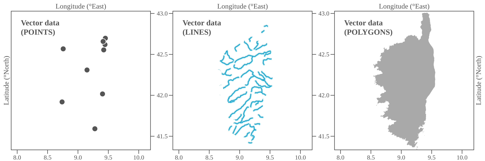
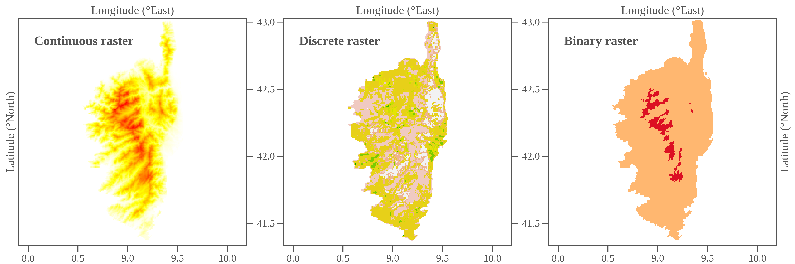
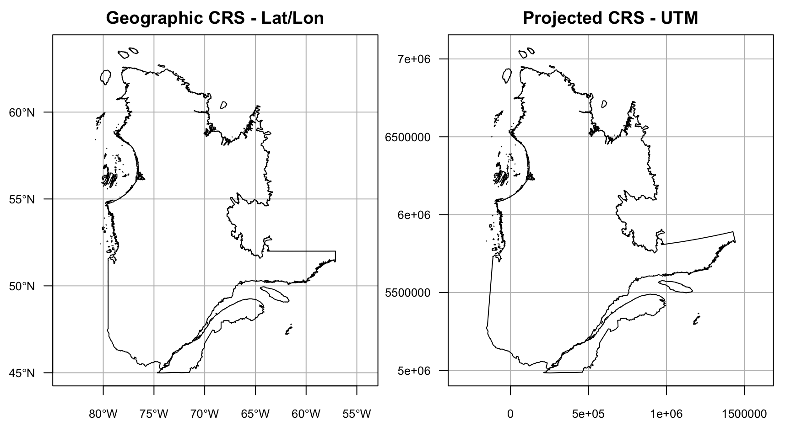
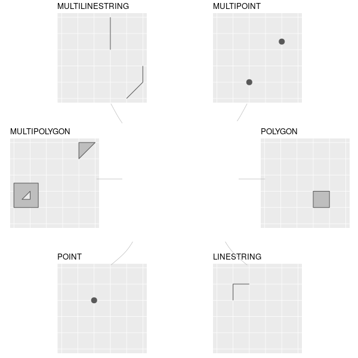
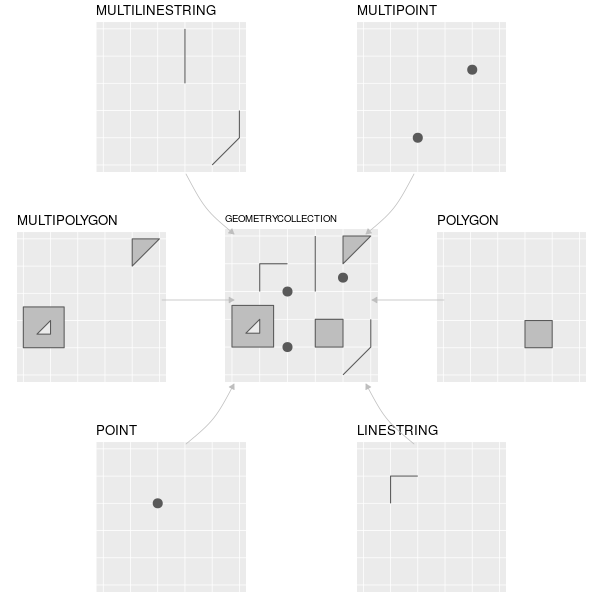
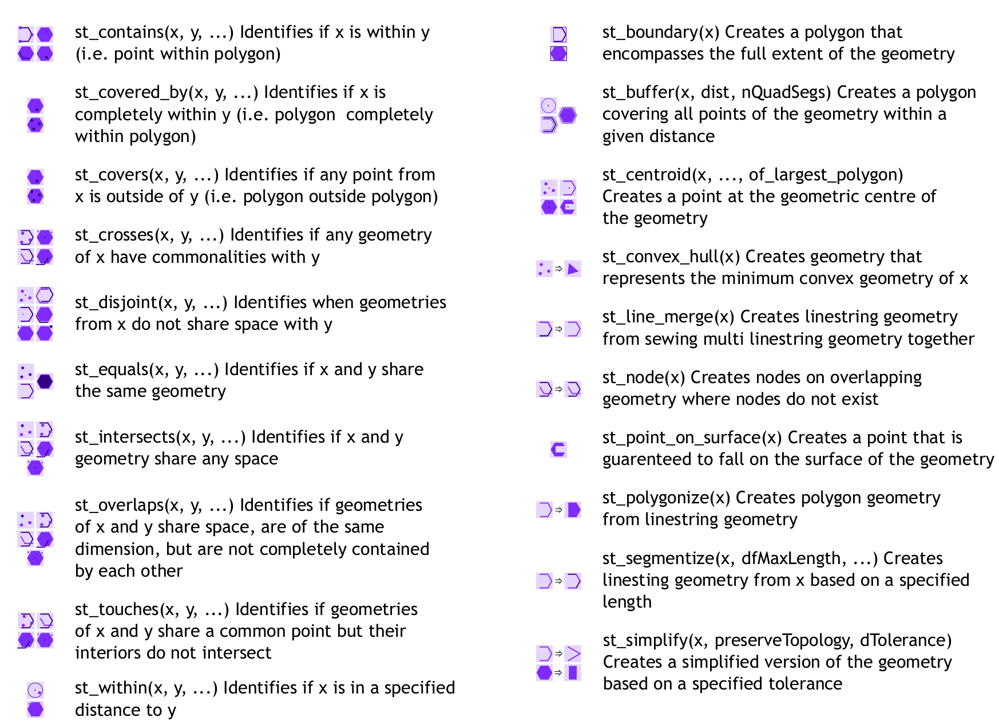
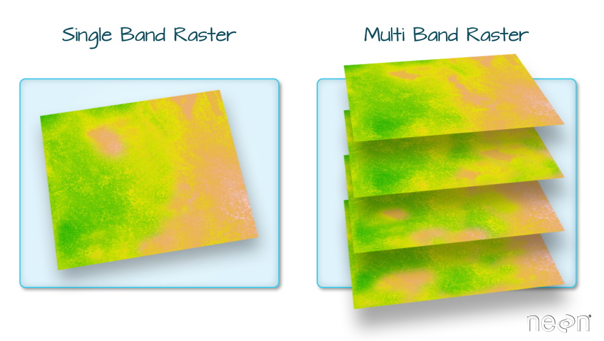
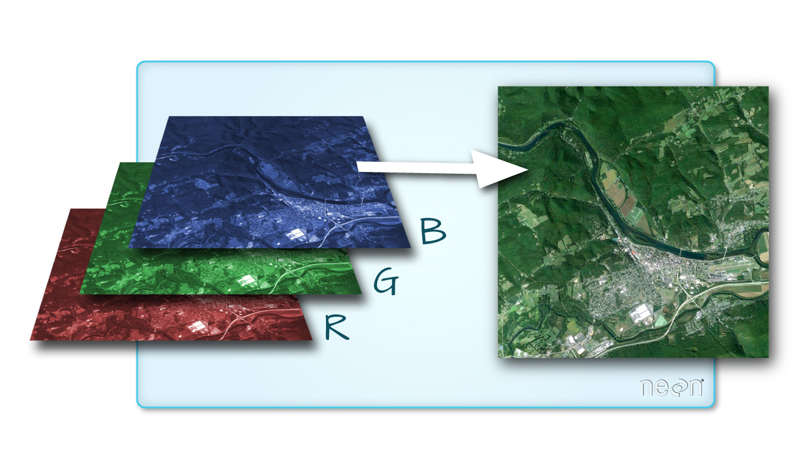

## À propos de ce cours

:::: {.columns}
::: {.column width="60%"}
Ce cours contient du matériel pédagogique développé par [inSileco](https://www.insileco.io/) dans le cadre de l'atelier **R in Space / R et espace**.

Cette présentation est disponible à l'adresse [steveviss.github.io/trainingSpatial](https://steveviss.github.io/trainingSpatial).

:::
::: {.column width="40%"}
{fig-align="center" width="40%"}
:::
::::

## Objectifs de la formation

À la fin de cette formation, vous serez en mesure de :

- Créer, importer et exporter des géométries vectorielles avec `sf`
- Réaliser des opérations spatiales courantes (filtrage, reprojection, tampon, découpage)
- Importer et manipuler des données raster avec `terra`
- Extraire, découper, reprojeter et empiler des couches matricielles
- Créer des cartes avec `ggplot2` et `tmap`

## Installation des packages

```r
install.packages(c("sf", "terra", "tmap"))
```

# Vue d'ensemble des objets spatiaux {background-color="#001d45"}

## Vecteurs spatiaux

{fig-align="center" width="100%"}

## Rasters

{fig-align="center" width="100%"}

# Système de référence des coordonnées (CRS) {background-color="#001d45"}

## CRS - Géographique vs projeté

:::: {.columns}
::: {.column width="50%"}
**Géographique**

- Coordonnées en **degrés** (lon/lat)
- Basé sur une sphère ou ellipsoïde
- Ex. : WGS84 (EPSG **4326**)
:::
::: {.column width="50%"}
**Projeté**

- Coordonnées cartésiennes **en mètres**
- Représentation 2D aplatie
- Ex. : NAD83 Lambert Canada (EPSG **3347**)
:::
::::

{fig-align="center" width="75%"}

## CRS - En pratique avec `sf`

Chaque CRS est identifié par un code **EPSG** - rechercher sur [epsg.io](https://epsg.io/)

```{r}
#| label: crs-fonctions
#| eval: false
sf::st_crs(4326)          # inspecter un CRS
sf::st_transform(obj, 3347)  # reprojeter
```

# Manipulation des vecteurs spatiaux {background-color="#001d45"}

Points, Lignes & Polygones

## Pourquoi `sf` ?

Les objets `sf` sont faciles à manipuler : stockés comme des `data.frame`, avec les géométries dans une colonne liste

{fig-align="center" width="70%"}

::: {style="font-size: 0.7em"}
Illustration de [Allison Horst](https://twitter.com/allison_horst/status/1071456081308614656)
:::

## Structure d'un objet `sf`

{fig-align="center" width="100%"}

## `sfg` - Géométrie simple (1)

{fig-align="center" width="70%"}

## `sfg` - Géométrie simple (2)

{fig-align="center" width="70%"}

# Créer des objets spatiaux {background-color="#001d45"}

## Points

Déclarer des sommets / points spatiaux (équivalent à un fichier .shp)

```{r}
#| label: points-declaration
library(sf)

ottawa    <- st_point(c(-75.69812, 45.41117))
sherbrooke <- st_point(c(-71.89908, 45.40008))
winnipeg  <- st_point(c(-97.14704, 49.8844))
calgary   <- st_point(c(-114.08529, 51.05011))
vancouver <- st_point(c(-123.11934, 49.24966))
```

Regrouper tous les points dans une colonne spatiale avec le CRS 4326 (WGS84)

```{r}
#| label: points-sfc
cities <- st_sfc(
  list(ottawa, sherbrooke, winnipeg, calgary, vancouver),
  crs = 4326
)
class(cities)
```

## Déclarer les attributs

```{r}
#| label: points-attributs
attr_table <- data.frame(
  N    = c(1236324, 212105, 804200, 1406700, 2463431),
  name = c("Ottawa", "Sherbrooke", "Winnipeg", "Calgary", "Vancouver")
)
attr_table
```

## Déclarer le CRS

```{r}
#| label: points-crs
proj <- st_crs(4326)
proj
```

## Attacher la table d'attributs et le CRS

```{r}
#| label: points-sf
great_cities <- st_sf(attr_table, geom = cities, crs = proj)
great_cities
```

## Vérification visuelle

```{r}
#| label: points-plot
#| fig-height: 4
#| fig-width: 6
#| fig-align: center
plot(great_cities[, "N"])
```

## Vérification visuelle (interactive)

:::: {.columns}
::: {.column width="50%"}
```{r}
#| label: points-mapview-code
#| eval: false
library(tmap)
tmap_mode("view")
tm_shape(great_cities) + tm_symbols()
```
:::
::: {.column width="50%"}
```{r}
#| label: points-mapview
#| echo: false
#| message: false
#| out-height: "65%"
#| out-width: "100%"
library(tmap)
tmap_mode("view")
tm_shape(great_cities) + tm_symbols()
```
:::
::::

## Lignes

```{r}
#| label: lignes-creation
#| fig-height: 4
#| fig-width: 4
#| fig-align: center
line <- st_linestring(rbind(c(0, 0), c(1, 1), c(2, 1)))
class(line)

plot(line, col = "red", lwd = 2)
plot(st_cast(line, "MULTIPOINT"), pch = 19, add = TRUE)
```

## Polygones

```{r}
#| label: polygones-creation
#| fig-height: 3
#| fig-width: 3
#| fig-align: center
outer <- matrix(c(0,0,10,0,10,10,0,10,0,0), ncol = 2, byrow = TRUE)
hole1 <- matrix(c(1,1,1,2,2,2,2,1,1,1),    ncol = 2, byrow = TRUE)
hole2 <- matrix(c(5,5,5,6,6,6,6,5,5,5),    ncol = 2, byrow = TRUE)
poly  <- st_polygon(list(outer, hole1, hole2))
plot(poly, col = "red")
```

C'est pourquoi on importe généralement les lignes et polygones depuis des shapefiles, et les points depuis des CSV.

# Importer et exporter des objets spatiaux {background-color="#001d45"}

## Importer des points depuis un CSV

```{r}
#| label: csv-import
ca_cities <- read.csv("data/ca_cities.csv")
head(ca_cities, 4)
```

. . .

Pour rendre ces données spatiales, il faut connaître :

- La latitude (`lat`)
- La longitude (`lng`)
- La projection (le CRS)

## Importer des points depuis un CSV

```{r}
#| label: csv-to-sf
#| out-height: "65%"
#| out-width: "100%"
sf_ca_cities_wgs84 <- st_as_sf(ca_cities, coords = c("lng", "lat"), crs = 4326)
sf_ca_cities_wgs84$admin <- ca_cities$admin
sf_ca_cities_wgs84
```

## Formats supportés par `sf`

`sf` peut lire un grand nombre de formats vectoriels grâce à la librairie GDAL/OGC.

```{r}
#| label: sf-drivers
st_drivers(what = "vector")[1:50, 1]
```

## Importer un shapefile ESRI

Côtes mondiales Natural Earth - [télécharger ici](https://naciscdn.org/naturalearth/10m/physical/ne_10m_coastline.zip) (déjà dans `data/ne-coastlines-10m/`)

## Fichiers d'un shapefile valide

- `.shp` : géométries (requis)
- `.shx` : index des géométries (requis)
- `.dbf` : table d'attributs (requis)
- `.prj` : système de coordonnées (utilisé par ArcGIS)

```{r}
#| label: coast-read
coast <- st_read("data/ne-coastlines-10m")
```

```{r}
#| label: coast-plot
#| fig-align: center
#| fig-height: 4
#| fig-width: 6
par(mar = rep(0, 4))
plot(st_geometry(coast))
```

## Importer depuis une GeoDatabase

Exemple : Programme de surveillance aquatique communautaire (CAMP)
([open.canada.ca](https://open.canada.ca/data/en/dataset/c4474517-3d9b-e581-a6e2-e95273f2058e))

```{r}
#| label: camp-read
st_layers("data/camp_station_summary_eng.gdb")
stations <- st_read("data/camp_station_summary_eng.gdb",
                    layer = "camp_station_summary_eng")
```

:::: {.columns}
::: {.column width="50%"}
```{r}
#| label: camp-mapview-code
#| eval: false
tmap_mode("view")
tm_shape(stations) + tm_symbols()
```
:::
::: {.column width="50%"}
```{r}
#| label: camp-mapview
#| echo: false
#| out-height: "50%"
#| out-width: "100%"
#| message: false
tmap_mode("view")
tm_shape(stations) + tm_symbols()
```
:::
::::

## Exporter des vecteurs spatiaux

Extraire le golfe du Saint-Laurent depuis les côtes mondiales :

```{r}
#| label: export-crop
#| warnings: false
area <- st_as_sfc("POLYGON((-71.19219092922373 51.818174659518405,-55.06426124172373 51.818174659518405,-55.06426124172373 45.47097576656452,-71.19219092922373 45.47097576656452,-71.19219092922373 51.818174659518405))")
area <- st_set_crs(area, 4326)
cropped_coast <- st_crop(coast, area)
```

```{r}
#| label: export-plot
#| fig-align: center
par(mar = rep(0, 4))
plot(st_geometry(cropped_coast))
```

## Exporter des vecteurs spatiaux

```{r}
#| label: export-write-sf
#| eval: false
st_write(cropped_coast, "data/cropped_coast.gpkg")
st_write(cropped_coast, "data/cropped_coast.shp")  # ESRI Shapefile
```

::: {.callout-tip}
Préférer **GeoPackage** (`.gpkg`) au Shapefile : un seul fichier, pas de limite de 255 caractères sur les noms de colonnes, supporte plusieurs couches.
:::

## Exercice pratique {.practice}

1. Télécharger le [shapefile des côtes](https://naciscdn.org/naturalearth/10m/physical/ne_10m_coastline.zip) sur votre ordinateur
2. Le lire avec `st_read()`

Si vous le souhaitez, essayez avec vos propres données ou d'autres shapefiles de <https://www.naturalearthdata.com/>

# Manipuler des objets spatiaux avec `sf` {background-color="#001d45"}

## Filtrer par attributs

Sélectionner les villes du Manitoba :

```{r}
#| label: filter-attributs
mb_cities <- subset(sf_ca_cities_wgs84, admin == "Manitoba")
mb_cities
```

## Filtrer par attributs

:::: {.columns}
::: {.column width="50%"}
```{r}
#| label: filter-attributs-map-code
#| eval: false
tmap_mode("view")
tm_shape(mb_cities) + tm_symbols() + tm_text("city")
```
:::
::: {.column width="50%"}
```{r}
#| label: filter-attributs-map
#| echo: false
#| out-height: "75%"
#| out-width: "100%"
#| message: false
tmap_mode("view")
tm_shape(mb_cities) + tm_symbols() + tm_text("city")
```
:::
::::

## Sélectionner / supprimer des entités

```{r}
#| label: select-row
mb_cities[1, ]
```

```{r}
#| label: select-remove
mb_cities[-c(1:5), ]
```

## Reprojeter

Passer de WGS84 (SRID 4326) à NAD83 / Lambert Canada (SRID 3347) :

```{r}
#| label: reprojeter-vecteur
sf_ca_cities_nad83 <- st_transform(sf_ca_cities_wgs84, 3347)
sf_ca_cities_nad83
```

## Créer des zones tampons

Zone tampon de 10 km autour des villes (POINT → POLYGONE) :

:::: {.columns}
::: {.column width="50%"}
```{r}
#| label: buffer-cities-code
#| eval: false
buf_10K_cities <- st_buffer(sf_ca_cities_nad83, 10000)
tmap_mode("view")
tm_shape(buf_10K_cities) + tm_polygons(alpha = 0.3)
```
:::
::: {.column width="50%"}
```{r}
#| label: buffer-cities
#| echo: false
#| out-width: "100%"
#| out-height: "55%"
#| message: false
buf_10K_cities <- st_buffer(sf_ca_cities_nad83, 10000)
tmap_mode("view")
tm_shape(buf_10K_cities) + tm_polygons(alpha = 0.3)
```
:::
::::

## Opérations spatiales avec `sf`

{fig-align="center" width="85%"}

[Télécharger le cheat sheet `sf`](https://github.com/rstudio/cheatsheets/blob/master/sf.pdf)

## Exercice pratique {.practice}

1. Télécharger et lire avec `sf` le [CSV des villes canadiennes](data/ca_cities.csv)
2. Sélectionner toutes les villes du Québec
3. Sélectionner les 10 villes les plus peuplées du Québec

# Convertir des points en lignes {background-color="#001d45"}

## Convertir des points en lignes

Relier les villes d'une même province forme une **LINESTRING** par groupe :

```{r}
#| label: points-to-lines-sf
library(dplyr)
city_lines_sf <- sf_ca_cities_wgs84 |>
  arrange(admin, population) |>
  group_by(admin) |>
  summarise(do_union = FALSE) |>
  st_cast("LINESTRING")
city_lines_sf
```

:::: {.columns}
::: {.column width="50%"}
```{r}
#| label: points-to-lines-tmap-code
#| eval: false
tmap_mode("view")
tm_shape(city_lines_sf) + tm_lines()
```
:::
::: {.column width="50%"}
```{r}
#| label: points-to-lines-tmap
#| echo: false
#| message: false
#| out-height: "65%"
#| out-width: "100%"
tmap_mode("view")
tm_shape(city_lines_sf) + tm_lines()
```
:::
::::

::: {.callout-note}
`st_cast("LINESTRING")` requiert que les points soient **ordonnés** avant le `group_by()`. L'ordre détermine la direction de la ligne.
:::

# Manipulation des rasters {background-color="#001d45"}

## Données spatiales matricielles

Les données matricielles sont gérées avec le package `terra`.

{fig-align="center" width="90%"}

136 formats raster supportés par la librairie GDAL.

## Diversité des formats

:::: {.columns}
::: {.column width="50%"}
**Exemples**

*Grilles*
```
GTiff: GeoTIFF
XYZ: ASCII Gridded XYZ
```

*Images*
```
PNG: Portable Network Graphics
JPEG: JPEG JFIF
```

*Multibandes (satellite)*
```
netCDF: Network Common Data Format
HDF4: Hierarchical Data Format 4
```
:::
::: {.column width="50%"}
{width="100%"}
:::
::::

## Charger un raster depuis un fichier

```{r}
#| label: raster-load
library(terra)
library(rnaturalearth)
ocean_bottom <- rast(
  ne_download(scale = 50, type = "OB_50M", category = "raster",
              destdir = "data/OB_LR", load = FALSE)
)
ocean_bottom
```

```{r}
#| label: raster-image
#| fig-height: 8
#| fig-width: 12
#| fig-align: center
image(ocean_bottom)
```

## Récupérer des données libres avec `geodata`

Le package `geodata` remplace `terra::getData()` :

- **`gadm()`** - limites administratives mondiales
- **`worldclim_country()`** - données climatiques interpolées
- **`elevation_30s()`** - données d'élévation (~1 km)

```{r}
#| label: elevation-load
library(geodata)
altCAN <- elevation_30s(country = "CAN", path = "data")
altCAN
```

## Visualiser le raster

```{r}
#| label: elevation-plot
#| fig-width: 12
#| fig-height: 7
#| fig-align: center
plot(altCAN)
```

## Extraire des valeurs à des emplacements précis

```{r}
#| label: elevation-extract
sf_ca_cities_wgs84$elev <- extract(altCAN, vect(sf_ca_cities_wgs84))[, 2]
sf_ca_cities_wgs84
```

## Découper et masquer un raster

`crop()` réduit l'étendue ; `mask()` met à NA les valeurs hors d'un polygone.

```{r}
#| label: crop-mask-show
can    <- st_as_sf(geodata::gadm(country = "CAN", level = 1, path = "data"))
qc     <- subset(can, NAME_1 == "Québec")
alt_qc <- crop(altCAN, qc)
alt_mask <- mask(crop(altCAN, qc), qc)
```

```{r}
#| label: crop-plot
#| echo: false
#| fig-align: center
#| fig-width: 12
#| fig-height: 6
par(mfrow = c(1, 2), mar = c(0, 0, 2, 0))
plot(alt_qc,   main = "crop()",  axes = FALSE)
plot(alt_mask, main = "mask()",  axes = FALSE)
```

## Reprojeter un raster

`project()` transforme le CRS d'un raster :

```{r}
#| label: raster-reproject
alt_qc_nad83 <- project(alt_qc, y = "+proj=lcc +lat_1=49 +lat_2=77
+lat_0=63.390675 +lon_0=-91.86666666666666 +x_0=6200000 +y_0=3000000 +ellps=GRS80
+towgs84=0,0,0,0,0,0,0 +units=m +no_defs")
```

```{r}
#| label: raster-reproject-plot
#| fig-width: 7
#| fig-height: 7
#| fig-align: center
plot(alt_qc_nad83)
```

## Rééchantillonnage raster

Modifier la résolution d'un raster avec `resample()` :

```{r}
#| label: resample-run
template_coarse <- rast(ext(alt_qc), resolution = 1, crs = crs(alt_qc))
alt_near     <- resample(alt_qc, template_coarse, method = "near")
alt_bilinear <- resample(alt_qc, template_coarse, method = "bilinear")
```

```{r}
#| label: resample-plot
#| echo: false
#| fig-width: 14
#| fig-height: 5
#| fig-align: center
par(mfrow = c(1, 3), mar = c(0, 0, 2, 0))
plot(alt_qc,       main = "Original",  axes = FALSE)
plot(alt_near,     main = "Near",      axes = FALSE)
plot(alt_bilinear, main = "Bilinear",  axes = FALSE)
```

::: {.callout-note}
`near` conserve les valeurs discrètes (rasters catégoriels). `bilinear` interpole les valeurs - adapté aux surfaces continues comme l'élévation.
:::

## Exercice pratique {.practice}

1. Lire avec `sf` le [CSV des villes canadiennes](data/ca_cities.csv)
2. Importer avec `geodata::elevation_30s()` le MNT canadien
3. Reprojeter le raster et les villes en NAD83
4. Créer une zone tampon de 10 km autour de chaque ville
5. Découper le raster avec ces tampons et calculer la moyenne par tampon

# Empiler des rasters {background-color="#001d45"}

## Stacking

Deux possibilités : par variable ou par période temporelle.

{fig-align="center" width="90%"}

## Exemple d'empilement

```{r}
#| label: stack-creation
rs_var1 <- rast(ncol = 10, nrow = 10)
rs_var2 <- rast(ncol = 10, nrow = 10)
rs_var1[] <- runif(100)
rs_var2[] <- runif(100)

st_vars <- c(rs_var1, rs_var2)
st_vars
```

## Convertir en data.frame

```{r}
#| label: stack-dataframe
as.data.frame(st_vars, xy = TRUE)
```

```{r}
#| label: stack-dataframe-single
#| eval: false
as.data.frame(rs_var1, xy = TRUE)
```

## Opérations arithmétiques

- Opérateurs classiques : `+`, `*`, `-`, etc.
  - `rs_var1 + rs_var2`
- Somme : `sum(st_vars)`
- Moyenne : `mean(st_vars)`
- Variance : `var(rs_var1)`
- Covariance : `cov(rs_var1, rs_var2)`
- Histogramme : `hist(rs_var1)`

# Flux de travail intégrés {background-color="#001d45"}

## Extraction raster par lignes

Valeur moyenne de l'élévation le long d'une ligne (ex. transect interprovincial) :

```{r}
#| label: extract-lines
# city_lines_sf créé dans la section "Convertir des points en lignes"
city_lines_vect <- vect(as(city_lines_sf, "Spatial"))
elev_lines <- extract(altCAN, city_lines_vect, fun = mean, na.rm = TRUE)
lines_elev <- city_lines_sf |> mutate(mean_elev = elev_lines[, 2])
lines_elev
```

## Extraction raster par polygones

Valeur moyenne de l'élévation par province :

```{r}
#| label: extract-polygons
prov_elev <- extract(altCAN, vect(can), fun = mean, na.rm = TRUE)
can$mean_elev <- prov_elev[, 2]
plot(can["mean_elev"], main = "Élévation moyenne par province")
```

## Résumer et construire un tableau d'analyse

Combiner l'extraction avec des statistiques par groupe :

```{r}
#| label: analysis-table
library(dplyr)

# Extraction raster aux points de villes
sf_ca_cities_wgs84$elev <- extract(altCAN, vect(sf_ca_cities_wgs84))[, 2]

# Résumé par province
analysis_table <- sf_ca_cities_wgs84 |>
  st_drop_geometry() |>
  group_by(admin) |>
  summarise(
    n_cities    = n(),
    pop_total   = sum(population, na.rm = TRUE),
    mean_elev   = mean(elev, na.rm = TRUE)
  ) |>
  arrange(desc(pop_total))

analysis_table
```

# Cartographie avancée {background-color="#001d45"}

## Exploration vs Communication

:::: {.columns}
::: {.column width="50%"}
**Exploration rapide**

- `plot()`
- `tmap` (mode interactif)
- QA/QC, inspection des données
:::
::: {.column width="50%"}
**Communication**

- `ggplot2`
- `tmap`
- Légendes, palettes, mise en page soignée
:::
::::

::: {.callout-note icon=false}
Utilisez les cartes exploratoires pour inspecter rapidement, puis passez à `ggplot2` ou `tmap` pour les cartes destinées à être partagées ou publiées.
:::

## Cartographie avec `ggplot2`

```{r}
#| label: map-ggplot2
library(ggplot2)
library(tidyterra)  # install.packages("tidyterra")

gg <- ggplot() +
  geom_spatraster(data = alt_qc) +
  scale_fill_viridis_c(name = "Élévation (m)", na.value = NA) +
  geom_sf(data = qc, fill = NA, color = "white", linewidth = 0.5) +
  geom_sf(data = subset(sf_ca_cities_wgs84, admin == "Québec"), aes(size = population),
          color = "#c0392b", alpha = 0.7) +
  coord_sf(expand = FALSE) +
  theme_minimal() +
  labs(title = "Élévation et villes du Québec", size = "Population")
gg
```

::: {.callout-tip}
`geom_spatraster()` vient du package `tidyterra` - il permet d'intégrer directement les objets `terra` dans `ggplot2`.
:::

## Cartographie avec `tmap`

:::: {.columns}
::: {.column width="50%"}
```{r}
#| label: map-tmap
#| eval: false
library(tmap)

tm <- tm_shape(alt_qc) +
  tm_raster(col.scale = tm_scale_continuous(values = "viridis"),
            col.legend = tm_legend(title = "Élévation (m)")) +
  tm_shape(qc) +
  tm_borders(col = "white") +
  tm_shape(subset(sf_ca_cities_wgs84, admin == "Québec")) +
  tm_symbols(fill = "population", size = 0.5,
             fill.scale = tm_scale_continuous(values = "reds")) +
  tm_layout(frame = FALSE, legend.outside = TRUE)
tm
```
:::
::: {.column width="50%"}
```{r}
#| label: map-tmap-out
#| echo: false
#| message: false
library(tmap)

tm <- tm_shape(alt_qc) +
  tm_raster(col.scale = tm_scale_continuous(values = "viridis"),
            col.legend = tm_legend(title = "Élévation (m)")) +
  tm_shape(qc) +
  tm_borders(col = "white") +
  tm_shape(subset(sf_ca_cities_wgs84, admin == "Québec")) +
  tm_symbols(fill = "population", size = 0.5,
             fill.scale = tm_scale_continuous(values = "reds")) +
  tm_layout(frame = FALSE, legend.outside = TRUE)
tm
```
:::
::::

## Exporter des cartes

::: {.panel-tabset}
##### `ggplot2`

```{r}
#| label: export-ggplot2
#| eval: false
ggsave("outputs/carte_qc.png", plot = gg, width = 10, height = 8, dpi = 300)
ggsave("outputs/carte_qc.pdf", plot = gg, width = 10, height = 8)
```

##### `tmap`

```{r}
#| label: export-tmap
#| eval: false
tmap_save(tm, "outputs/carte_qc.png", width = 10, height = 8, dpi = 300)

# Export interactif HTML
tmap_mode("view")
tmap_save(tm, "outputs/carte_qc.html")
tmap_mode("plot")
```
:::

# Ressources en ligne {background-color="#001d45"}

## Tutoriels (1/3)

### Tutoriels sur les données spatiales en R

- [Raster analysis in R](https://mgimond.github.io/megug2017/)
- [Geocomputation with R](https://geocompr.robinlovelace.net/intro.html)
- [Spatial data in R](https://github.com/Pakillo/R-GIS-tutorial/blob/master/R-GIS_tutorial.md)
- <http://r-spatial.org/>

### Manipulation avec `sf`

- [sf vignette #4](https://cran.r-project.org/web/packages/sf/vignettes/sf4.html)
- [Geocomputation with R](https://geocompr.robinlovelace.net/attr.html)

## Cartographie en R (2/3)

- [Introduction to visualising spatial data in R](https://cran.r-project.org/doc/contrib/intro-spatial-rl.pdf)
- [Geocomputation with R](https://geocompr.robinlovelace.net/adv-map.html)
- [choropleth](https://cengel.github.io/rspatial/4_Mapping.nb.html)
- [leaflet](https://rstudio.github.io/leaflet/)
- [tmap](https://r-tmap.github.io/tmap/)
- [tmap](https://r-tmap.github.io/tmap/)

## Données libres (3/3)

- [Données libres Québec](https://www.donneesquebec.ca/recherche/dataset?vocab_type_donnees=Donn%C3%A9es+g%C3%A9ographiques)
- [sdmpredictors](https://cran.r-project.org/web/packages/sdmpredictors/index.html)
- [Répertoire de données spatiales libres](https://freegisdata.rtwilson.com/)
- [Créer un shapefile en ligne](http://geojson.io/)
- EPSG : [spatialreference.org](http://spatialreference.org/) · [epsg.io](http://epsg.io/)
